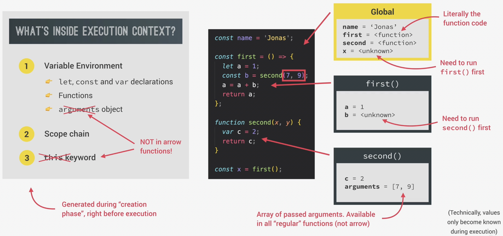
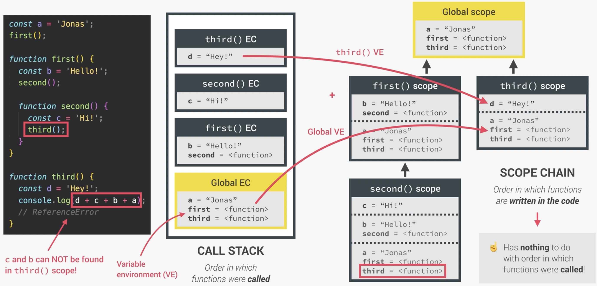
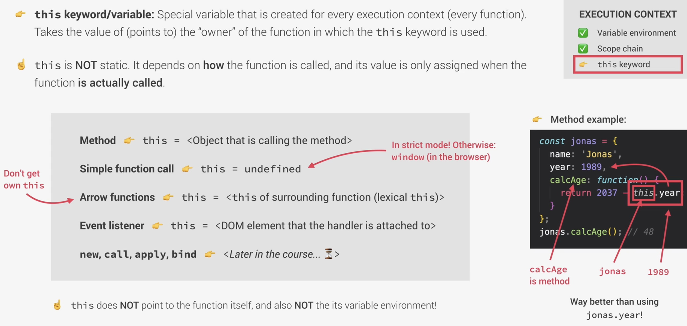
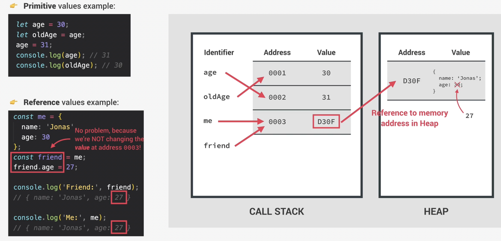
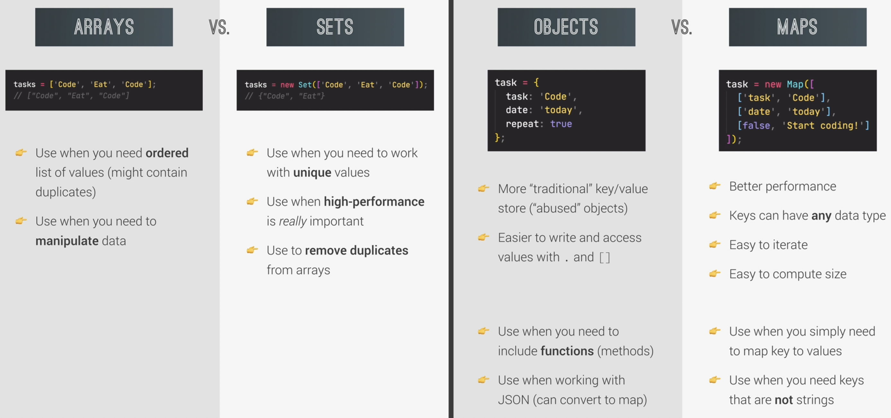

# Notes for JS Course

[The Complete JavaScript Course 2022: From Zero to Expert!](https://www.udemy.com/course/the-complete-javascript-course)

## About

This course was divided into sections, each focused on teaching a specific JavaScript concept through a lecture and an assignment. In the assignments, you write code to accomplish a particular goal using the knowledge from the lecture, followed by guidance on how the code should ideally be written. The HTML and CSS in the provided links were supplied by the course, and I developed the functionality using JavaScript based on a design spec. Most course sections don't include a web interface; instead, they involve writing JavaScript code directly in the browser's console, so a web interface isn't shown for those sections.

## Table of Contents

- [Notes for JS Course](#notes-for-js-course)
  - [About](#about)
  - [Table of Contents](#table-of-contents)
  - [Section 2: JavaScript Fundamentals - Part 1](#section-2-javascript-fundamentals---part-1)
    - [Miscellaneous](#miscellaneous)
    - [Linking a JS file](#linking-a-js-file)
    - [Data types](#data-types)
    - [let, const and var](#let-const-and-var)
    - [Basic operators](#basic-operators)
      - [Math operators](#math-operators)
      - [Assignment operators](#assignment-operators)
    - [Type Conversion](#type-conversion)
    - [Type Coercion](#type-coercion)
    - [Falsey values](#falsey-values)
    - [Equality Operators: == vs. ===](#equality-operators--vs-)
    - [Logical operators](#logical-operators)
    - [Switch case](#switch-case)
    - [The Conditional (Ternary) Operator](#the-conditional-ternary-operator)
  - [Section 3: JavaScript Fundamentals - Part 2](#section-3-javascript-fundamentals---part-2)
    - [Strict mode](#strict-mode)
    - [Function declarations vs expressions](#function-declarations-vs-expressions)
    - [Arrow functions](#arrow-functions)
    - [Arrays](#arrays)
      - [Array functions](#array-functions)
    - [Objects](#objects)
    - [For-loop](#for-loop)
    - [While-loop](#while-loop)
  - [Section 5: Developer Skills \& Editor Setup](#section-5-developer-skills--editor-setup)
    - [Debugging](#debugging)
  - [Section 7: JavaScript in the Browser: DOM and Events Fundamentals](#section-7-javascript-in-the-browser-dom-and-events-fundamentals)
    - [DOM manipulation](#dom-manipulation)
  - [Section 8: How JavaScript Works Behind the Scenes](#section-8-how-javascript-works-behind-the-scenes)
    - [How JS works bts: Execution Context](#how-js-works-bts-execution-context)
      - [Variable environment](#variable-environment)
        - [Arguments object](#arguments-object)
      - [Scope chain](#scope-chain)
      - [`this` keyword](#this-keyword)
      - [Regular functions vs Arrow functions](#regular-functions-vs-arrow-functions)
    - [How JS works bts: Hoisting and Temporal Dead Zone](#how-js-works-bts-hoisting-and-temporal-dead-zone)
    - [Primatives vs Objects](#primatives-vs-objects)
  - [Section 9: Data Structures, Modern Operators and Strings](#section-9-data-structures-modern-operators-and-strings)
    - [Destructuring Arrays](#destructuring-arrays)
    - [Destructuring Objects](#destructuring-objects)
    - [The Spread operator (...)](#the-spread-operator-)
    - [Rest patterns and parameters](#rest-patterns-and-parameters)
    - [Short Circuiting (\&\& and ||)](#short-circuiting--and-)
    - [The Nullish Coalescing Operator (??)](#the-nullish-coalescing-operator-)
    - [Logical Assignment Operators (||= ??= \&\&=)](#logical-assignment-operators---)
    - [for-of loop](#for-of-loop)
    - [Enhanced Object Literals](#enhanced-object-literals)
    - [Optional Chaining](#optional-chaining)
    - [Looping Objects: Object keys, Values and Entries](#looping-objects-object-keys-values-and-entries)
    - [Sets](#sets)
    - [Maps: Fundamentals](#maps-fundamentals)
    - [Maps: Iteration](#maps-iteration)
    - [Which data structure to use?](#which-data-structure-to-use)
    - [Working with Strings - Part 1](#working-with-strings---part-1)
    - [Working with Strings - Part 2](#working-with-strings---part-2)
    - [Working with Strings - Part 3](#working-with-strings---part-3)
  - [Section 10: A Closer Look at Functions](#section-10-a-closer-look-at-functions)
    - [Default Parameters](#default-parameters)
    - [Functions Accepting Callback Functions](#functions-accepting-callback-functions)
    - [Functions Returning Functions](#functions-returning-functions)
    - [The call and apply Methods](#the-call-and-apply-methods)
    - [The bind method](#the-bind-method)
    - [Immediately Invoked Function Expressions (IIFE)](#immediately-invoked-function-expressions-iife)
    - [Closures](#closures)
  - [Section 11: Working with Arrays](#section-11-working-with-arrays)
    - [Simple Array Methods](#simple-array-methods)
    - [The new at Method](#the-new-at-method)
    - [Looping Arrays: forEach](#looping-arrays-foreach)
    - [forEach with Maps and Sets](#foreach-with-maps-and-sets)
    - [The map Method](#the-map-method)
    - [The filter Method](#the-filter-method)
    - [The reduce Method](#the-reduce-method)
    - [The find Method](#the-find-method)
    - [The findIndex Method](#the-findindex-method)
    - [some and every](#some-and-every)
    - [flat and flatMap](#flat-and-flatmap)
    - [Array Sorting](#array-sorting)
    - [More Ways of Creating and Filling Arrays](#more-ways-of-creating-and-filling-arrays)

## Section 2: JavaScript Fundamentals - Part 1

### Miscellaneous

```js
alert("Hello, world!");
const input = prompt("Favourite colour?");
console.log("logging", 3, "values");

// "" vs '' vs ``(template literal)
"I'm " + firstName + "!";
"I'm " + firstName + "!";
`I'm ${firstName} and my age is ${year - dob}`;

// operator precedence
let x, y;
x = y = 25 - 10 - 5;
```

### Linking a JS file

script reference goes at bottom of body

```html
<html>
  <head>
    ...
  </head>
  <body>
    ...
    <script src="“script.js”"></script>
  </body>
</html>
```

### Data types

- Primative types
  - Boolean: `true, false`
  - Null: `null`
  - Undefined:
  - Number: `1`
  - BigInt: `1000n` append n to number
  - String: `"hello"`
  - Symbol: used as the key of an Object property
- Objects (collections of properties)

```js
typeof "apple"; //string
```

### let, const and var

`let` and `const` released in 2015 (ES6)

use `let` 👶🏼, not `var` 👵🏼

use `const` over `let`, unless data will change

`let` and `const` are block / function scoped. `var` is function scoped

### Basic operators

#### Math operators

`+` addition

`-` subtraction

`*` multiplication

`/` division

`**` power

#### Assignment operators

```js
let x = 10 + 5; // 15
x += 10; // 25
x *= 4; // 100
x++; // 101
x--; // 100
```

### Type Conversion

```js
Number("44"); // 44
String(44); // '44'
```

### Type Coercion

`+` converts numbers to strings

`-` converts strings to numbers

`<` converts strings to numbers. if both strings, compare unicode values

```js
"9" - "5"; // 4
"19" - "13" + "17"; // 6 + '17' = '617'
"19" - "13" + 17; // 6 + 17 = 23
"123" < 57; // false
5 + 6 + "4" + 9 - 4 - 2; // 1149 - 4 - 2 = 1143
```

### Falsey values

5 falsey values: `0, '', undefined, null, NaN`

```js
Boolean(0); //false
Boolean(1); //true
Boolean("John"); //true
Boolean(""); //false
Boolean({}); //true
Boolean(undefined); //false

const money = 0;
if (money) {
  console.log("You have money!");
} else {
  console.log("You have no money.");
}
```

### Equality Operators: == vs. ===

TLDR: pretend `==` and `!=` don't exist

`==` loose (performs type coercion)

`===` strict

`!=` loose (performs type coercion)

`!==` strict

```js
18 === 18; //true
18 == 18; //true
18 === "18"; //false
18 == "18"; //true
```

### Logical operators

```js
&& //and
|| //or
! //not
```

### Switch case

```js
switch (expression) {
  case x:
    // code block
    break;
  case y:
    // code block
    break;
  default:
  // code block
}
```

### The Conditional (Ternary) Operator

`condition ? expression(truthy) : expression(falsey)`

```js
`x is ${x > 33 ? "above" : "below"} average`;
```

## Section 3: JavaScript Fundamentals - Part 2

### Strict mode

`'use strict';` first thing in file

forbits you to do certain things

gives errors rather than failing silently

### Function declarations vs expressions

```js
// function declaration
function percentageOfWorld(population) {
  return (population / 7900) * 100;
}

//function expression
const percentageOfWorld = function (population) {
  return (population / 7900) * 100;
};
```

### Arrow functions

```js
// one line
const calcAge = birthYear => 2037 - birthYear;
const calcAverage = (1, 2, 3) => (1 + 2 + 3) / 3;

console.log(calcAge(1991));
console.log(calcAverage(4,5,6));

// multi line
const yearsUntilRetirement = (birthYear, firstName) => {
    const age = 2037 - birthYeah;
    const retirement = 65 - age;
    return `${firstName} retires in ${retirement} years`;
}
console.log(yearsUntilRetirement(1991, 'John'));
```

### Arrays

```js
const people = ["Alice", "Bob", "Charlie"];

people[0]; // Alice
people[people.length() - 1]; // Bob

people[1] = "Jill";
```

#### Array functions

```js
// Add elements
people.push("Dan"); // Add to end
people.unshift("Adam"); // Add to start

// Remove elements
people.pop(); // Remove end
people.shift(); // Remove start

people.indexOf("Bob"); // 1
people.includes("Bob"); // true (strict)
```

### Objects

```js
const person = {
  firstName: "John",
  lastName: "Smith",
  birthYear: 1995,
  job: "Bus driver",
  friends: ["Alice", "Bob", "Charlie"],
  hasDriversLicense: true,
  calcAge: function () {
    this.age = 2037 - this.birthYear;
    return this.age;
  },
  getSummary: function () {
    return `${this.firstName} is a ${this.calcAge()}-year old ${
      this.job
    }, and he has ${this.hasDriversLicense ? "a" : "no"} driver's license`;
  },
};

//  Dot vs. Bracket Notation
const nameKey = "Name";
person.birthYear += 2; // dot
person["birthYear"] -= 2; // bracket
person["first" + nameKey] = "Bill"; // bracket
```

### For-loop

```js
const voters = ["Alice", "Bob", "Charlie"];

for (let i = 0; i <= voters.length; i++) {
  // break current iteration, move onto next
  if (voters[i] === "Bob") continue;

  // break out of for loop
  if (voters[i] === "Charlie") break;

  console.log(`${voters[i]} is voting`);
}
```

### While-loop

```js
const voters = ["Alice", "Bob", "Charlie"];

let i = 0;
while (i <= voters.length) {
  console.log(`${voters[i]} is voting`);
  i++;
}
```

## Section 5: Developer Skills & Editor Setup

### Debugging

```js
console.warn("Hello");
console.error("Hello");
console.table(personObject); // show object nicely
```

## Section 7: JavaScript in the Browser: DOM and Events Fundamentals

### DOM manipulation

```js
// change text
document.querySelector('.message').textContent;
document.querySelector('.guess').value; // input

// change style
document.querySelector('.number').style.width = '15rem';
document.body.style.backgroundColor = '#222';

// event listener: click
document.querySelector('.again').addEventListener('click', function () {
  gamePaused = false;
  secretNumber = generateNumber();
});

// event listener: key press
document.addEventListener('keydown', function (e) {
  if (e.key === 'Escape') hideModal();
});

// editing classes
overlay.classList.add('hidden');
overlay.classList.remove('hidden');
overlay.classList.toggle('hidden');
if (overlay.classList.contains('hidden'))
```

## Section 8: How JavaScript Works Behind the Scenes

### How JS works bts: Execution Context

Contains:

- Variable Environment
- Scope chain
- `this` keyword

Environment in which a piece of JS is executed.

Stores all necessary info for the code to be executed.

**One** Global Execution Context, **One** Execution Context per function



#### Variable environment

- `let`, `const`, `var` declarations
- Functions
- `arguments` object

##### Arguments object

Arrow functions do **not** have an `arguments` object

```js
function expr(b, c) {
  console.log(arguments); // [0, 1, 2, 3]
  console.log(arguments[3]); // 3
}
expr(0, 1, 2, 3);

const arrow = (b, c) => {
  console.log(arguments); // arguments not defined
};
arrow(0, 1, 2, 3);
```

#### Scope chain



#### `this` keyword



```js
"use strict";

console.log(this); // Window

const calcAge = function (birthYear) {
  console.log(2035 - birthYear);
  console.log(this); // strict mode: undefined, sloppy mode: Window
};
calcAge(1990);

const calcAgeArrow = (birthYear) => {
  console.log(2035 - birthYear);
  console.log(this); // Window
};
calcAgeArrow(1980);

const john = {
  year: 1990,
  calcAge: function () {
    console.log(2035 - this.year);
    console.log(this); // Object (john)
  },
};
john.calcAge(1970);
```

#### Regular functions vs Arrow functions

```js
const john = {
  firstName: "John",
  year: 1990,
  calcAge: function () {
    console.log(2035 - this.year);
    console.log(this); // this: john

    const self = this;
    const isMillenial = function () {
      console.log(this); // this: undefined
      console.log(self); // self: john
    };
    isMillenial();

    const isMillenial2 = () => {
      console.log(this); // this: john
    };
    isMillenial2();
  },
  greet: () => console.log(`Hey ${this.firstName}`),
};
john.calcAge(1970);

var firstName = "bill";
john.greet(); // Hey bill
```

### How JS works bts: Hoisting and Temporal Dead Zone

variables / functions are 'hoisted' to the beginning of code.

Trying to access before initialization:

`var` = 'undefined' (leads to bugs)

`let` and `const` gives ReferenceError (knows they exist since they're in TDZ)

```js
console.log(a); // undefined
console.log(b); // error: can't access before initialization
console.log(c); // error: can't access before initialization
console.log(d); // error: d is not defined
console.log(addDecl(1, 2)); // 3
console.log(addExp(1, 2)); // error: can't access before initialization
console.log(addArrow(1, 2)); // error: addArrow is not a function

//Variables
var a = "a";
let b = "b";
const c = "c";

//Functions
function addDecl(a, b) {
  return a + b;
}

const addExp = function (a, b) {
  return a + b;
};

var addArrow = (a, b) => a + b; // called above: undefined(1, 2)
```

### Primatives vs Objects



```js
// creates a shallow copy (only copies first level, not deep clone)
const objectCopy = Object.assign({}, object);
```

```js
const john = {
  firstName: "john",
  lastName: "smith",
};

const johnMarried = john;
johnMarried.lastName = "adams";
console.log(john.lastName); // adams
console.log(johnMarried.lastName); // adams

const john2 = {
  firstName: "john",
  lastName: "smith",
  family: ["Alice", "Bob"],
};

const johnCopy = Object.assign({}, john2);
johnCopy.lastName = "adams";
johnCopy.family.push("Charlie");
console.log(john2.lastName); // smith
console.log(johnCopy.lastName); // adams
console.log(john2.family); // [Alice, Bob, Charlie]
console.log(johnCopy.family); // [Alice, Bob, Charlie]
```

## Section 9: Data Structures, Modern Operators and Strings

### Destructuring Arrays

get elements out of Array and assign them to new variables

```js
// without destructuring
const arr = [2, 3, 4];
const a = arr[0];
const b = arr[1];
const c = arr[2];
console.log(a, b, c); // 2 3 4

// with destructoring
const [x, y, z] = arr;
console.log(x, y, z); // 2 3 4

const categories = ["Italian", "Pizzeria", "Vegetarian", "Organic"];

let [main, , secondary] = categories;
console.log(main, secondary); // Italian Vegetarian

// swapping elements
const temp = main;
main = secondary;
secondary = temp;
console.log(main, secondary); // Vegetatian Italian

// swapping elements (mutating variables) with destructuring
[main, secondary] = [secondary, main];
console.log(main, secondary); // Italian Vegetarian

// receive 2 values from function
const func = () => [1, 2];
const [first, second] = func();
console.log(first, second); // 1 2

// nested destructuring
const nested = [1, 2, [3, 4]];
const [i, , [j, k]] = nested;
console.log(i, j, k); // 1 3 4

// default values
const [p = 1, q = 1, r = 1] = [8, 9];
console.log(p, q, r); // 8 9 1 (1 = undefined if default not set)
```

### Destructuring Objects

```js
const restaurant = {
  name: "Classico Italiano",
  location: "Via Angelo Tavanti 23, Firenze, Italy",
  categories: ["Italian", "Pizzeria", "Vegetarian", "Organic"],
  starterMenu: ["Focaccia", "Bruschetta", "Garlic Bread", "Caprese Salad"],
  mainMenu: ["Pizza", "Pasta", "Risotto"],

  openingHours: {
    fri: {
      open: 11,
      close: 23,
    },
    sat: {
      open: 0, // Open 24 hours
      close: 24,
    },
  },
  order: function (starterIndex, mainIndex) {
    return [this.starterMenu[starterIndex], this.mainMenu[mainIndex]];
  },
  orderDelivery: function ({
    starterIndex = 1,
    mainIndex = 0,
    time = "20:00",
    address,
  }) {
    console.log(
      `Order received: ${this.starterMenu[starterIndex]} and ${this.mainMenu[mainIndex]} will be delivered to ${address} at ${time}`
    );
  },
  orderPasta: function (ing1, ing2, ing3) {
    console.log(`Pasta made with ${ing1}, ${ing2} and ${ing3}`);
  },
  orderPizza: function (mainIngredient, ...otherIngredients) {
    console.log(mainIngredient); // pickles
    console.log(otherIngredients); // [cheese, onions]
  },
};

// calling function with different argument order using object
restaurant.orderDelivery({
  time: "22:30",
  address: "21 Jump St",
  mainIndex: 1,
  starterIndex: 2,
});

restaurant.orderDelivery({
  address: "21 Jump St",
  mainIndex: 2,
});

// destructuring object
const { name, openingHours, categories } = restaurant;
console.log(name, openingHours, categories); // Classico Italiano, Object, Array

// custom variable names
const {
  name: restaurantName,
  openingHours: hours,
  categories: tags,
} = restaurant;
console.log(restaurantName, hours, tags); // Classico Italiano, Object, Array

// default values
const { menu = [], starterMenu: starters = [] } = restaurant;
console.log(menu, starters); // [], Array (menu = undefined if default not set)

// mutating variables
let a = 111;
let b = 999;
const obj = { a: 23, b: 56 };
({ a, b } = obj);
console.log(a, b); // 23, 56

// nested objects
const {
  fri: { open: o, close: c },
} = openingHours;
console.log(o, c); // 11 23
```

### The Spread operator (...)

Gets all elements of an array but doesn't create new variables.

Use it where we would write values seperated by commas, such as passing arguments into a function, or building a new array

Works on all iterables (arrays, strings, maps, sets), and objects (since ES2018)

```js
const arr = [7, 8, 9];
const badNewArr = [1, 2, arr[0], arr[1], arr[2]]; // bad way

const newArr = [1, 2, ...arr]; // good way
console.log(newArr); // [1, 2, 7, 8, 9]
console.log(...newArr); // 1 2 7 8 9

const newMenu = [...restaurant.mainMenu, "Gnocci"];
console.log(newMenu); // [Pizza, Pasta, Risotto, Gnocci]

// shallow copy array
const mainMenuCopy = [...restaurant.mainMenu];
console.log(mainMenuCopy);

// join arrays
const menu = [...restaurant.starterMenu, ...restaurant.mainMenu];

const str = "John";
const letters = [...str, " ", "S."];
console.log(letters); // [J, o, h, n, S.]

// calling function
const ingredients = ["cheese", "ham", "basil"];
restaurant.orderPasta(...ingredients);

// objects
const newRestaurant = { foundedIn: 1998, ...restaurant, founder: "Bill" };
console.log(newRestaurant);

// shallow copy object
const restaurantCopy = { ...newRestaurant };
```

### Rest patterns and parameters

Opposite of Spread: Spread unpacks an array, Rest packs an array

Same syntax `...` as spread, but on left side of `=` operator

```js
// 1) Destructoring

// SPREAD, because on RIGHT side of =
const arr = [1, 2, ...[3, 4]]; // 1 2 3 4

// REST, because on LEFT side of =
const [a, b, ...others] = [1, 2, 3, 4, 5];
console.log(a, b, others); // 1 2 [3, 4, 5]

// arrays
const [pizza, , risotto, ...otherFood] = [
  ...restaurant.mainMenu,
  ...restaurant.starterMenu,
];
console.log(pizza, risotto, otherFood); // doesn't include skipped elements (pasta)

// objects
const { sat, ...weekdays } = restaurant.openingHours;
console.log(weekdays); // { thu: {...}, fri: {...} }
```

```js
// 2) Functions
const add = function (...numbers) {
  let sum = 0;
  for (let i = 0; i < numbers.length; i++) sum += numbers[i];
  console.log(sum);
};
add(2, 3); // 5
add(5, 3, 7, 2); // 17

const x = [23, 4, 6];
add(...x); // 33

restaurant.orderPizza = function (mainIngredient, ...otherIngredients) {
  console.log(mainIngredient); // pickles
  console.log(otherIngredients); // [cheese, onions]
};
restaurant.orderPizza("pickles", "cheese", "onions");
```

### Short Circuiting (&& and ||)

`value1 || value2 || value3`

return first truthy value, or last value if all are falsey

```js
console.log(undefined || 0 || "" || "Hello" || 23 || null); // 'Hello'
```

```js
// practical example
restaurant.numGuests = 0;
const guests1 = restaurant.numGuests ? restaurant.numGuests : 10; // 10
const guests2 = restaurant.numGuests || 10; // 10
```

`value1 && value2 && value3`

return first falsey value, or last value if all are truthey

```js
console.log("Hello" && 23 && null && "john"); // null
```

```js
// practical example
if (restaurant.orderPizza) {
  restaurant.orderPizza("mushroom", "spinach");
}

restaurant.orderPizza && restaurant.orderPizza("mushroom", "spinach");
```

### The Nullish Coalescing Operator (??)

Introduced in ES2020.

Similar to `||` but uses concept of nullish (`null`, `undefined`) rather than falsey values

```js
// restaurant.numGuests = 0;
const guests = restaurant.numGuests ?? 10; // 10

restaurant.numGuests = 0;
const guests2 = restaurant.numGuests ?? 10; // 0
```

### Logical Assignment Operators (||= ??= &&=)

Introduced in ES2021

```js
const rest1 = {
  name: "pizza place",
  numGuests: 0,
};
const rest2 = {
  name: "pizza town",
  owner: "john",
};

// OR assignment operator
// rest1.numGuests = rest1.numGuests || 10;
rest1.numGuests ||= 10; // assign value (10) to variable if it's falsey

// nullish assignment operator (null, undefined)
rest1.numGuests ??= 10; // assign value (10) to variable if it's nullish

// AND assignment operator
// rest1.owner = rest1.owner && 'anonymous'; // set to undefined
rest2.owner &&= "<ANONYMOUS>"; // assign value to variable if it's truthey
```

### for-of loop

can use `continue` and `break`;

```js
const menu = [...restaurant.starterMenu, ...restaurant.mainMenu];

// simple
for (const item of menu) console.log(item);

// getting index values
// menu.entries() is array of arrays containing [index, element]
for (const item of menu.entries()) {
  console.log(`${item[0] + 1}: ${item[1]}`);
}

// destructured
for (const [i, el] of menu.entries()) {
  console.log(`${i + 1}: ${el}`);
}
```

### Enhanced Object Literals

Assigning an outside object into an object

```js
const openingHours = {
  fri: {
    open: 11,
    close: 23,
  },
  sat: {
    open: 0,
    close: 24,
  },
};

const shop = {
  openingHours: openingHours, // pre-ES6
  openingHours, // ES6
};
```

Assigning functions in an object

```js
const greeter = {
  // pre-ES6
  greet: function (name) {
    console.log(`Hello ${name}`);
  },
  // ES6
  greet(name) {
    console.log(`Hello ${name}`);
  },
};
```

Computed property names

```js
const weekdays = ["mon", "tue", "wed"];

const openingHours2 = {
  [weekdays[0]]: {
    open: 11,
    close: 23,
  },
  [`day-${2 + 4}`]: {
    open: 0,
    close: 24,
  },
};
```

### Optional Chaining

Introduced in ES2020

Often used with Nullish Coalescing Operator (??)

`.?` if value on left nullish, return undefined.

```js
// without
console.log(restaurant.openingHours.mon.open); // error

// WITH Optional Chaining
console.log(restaurant.openingHours.mon?.open); // undefined
console.log(restaurant.openingHours?.mon?.open); // undefined

// Example
const weekdays = ["mon", "tue", "wed", "thu", "fri", "sat", "sun"];
for (const day of weekdays) {
  const open = restaurant.openingHours[day]?.open ?? "closed";
  console.log(`On ${day}, we open at ${open}`);
}

// methods
console.log(restaurant.order?.(1, 2) ?? "Method does not exist");

// arrays
const users = [{ name: "John", email: "john@email.com" }];
console.log(users[0]?.name ?? "users array is empty");
```

### Looping Objects: Object keys, Values and Entries

```js
// property NAMES
const properties = Object.keys(openingHours2);
console.log(`We are open on ${properties.length} days`);
for (const day of properties) console.log(day);

// property VALUES
const values = Object.values(openingHours2);
console.log(values);

// entire object
const entries = Object.entries(openingHours2);
console.log(entries);

for (const [key, { open, close }] of entries) {
  console.log(`On ${key}, we open at ${open} and close at ${close}`);
}
```

### Sets

Contains only unique values

```js
const ordersSet = new Set(["Pizza", "Pasta", "Pizza", "Sausage"]);

console.log(ordersSet); // Pizza, Pasta, Sausage

console.log(new Set("Sally")); // S, a, l, y

// size
console.log(ordersSet.size); // 3

// has
console.log(ordersSet.has("Pasta")); // true

// add
ordersSet.add("Bread");

// delete
ordersSet.delete("Pasta");

// clear
ordersSet.clear();

// iterating over Set
for (const order of ordersSet) console.log(order);

// Example
const staff = ["Waiter", "Chef", "Waiter", "Manager", "Chef", "Waiter"];
const staffUnique = [...new Set(staff)]; // Waiter, Chef, Manager
console.log(new Set(staff).size); // 3
console.log(new Set("oiegheoruhgosnisgoh").size); // 9
```

### Maps: Fundamentals

Like an Object, but key can be any type

```js
const rest = new Map();

// set
rest.set("name", "cluckin bell");
rest.set(1, "1 Fake St");
rest.set(2, "2 Fake St");

rest
  .set("categories", ["burgers", "chicken", "salad"])
  .set("open", 11)
  .set("close", 23)
  .set(true, `We're open :)`)
  .set(false, `We're closed :()`);

// get
console.log(rest.get("name")); // 'cluckin bell'
console.log(rest.get(true)); // 'We're open :)'
console.log(rest.get(1)); // '1 Fake St'

// get example
const time = 21;
console.log(rest.get(time >= rest.get("open") && time < rest.get("close"))); // 'We're open :)'

// has
console.log(rest.has("categories")); // true

// delete
rest.delete(2);

// size
rest.size; // 7

// clear
rest.clear();

// Objects as Map keys
const arr = [1, 2];
rest.set(arr, "Test");
rest.set(document.querySelector("h1"), "heading");
console.log(rest.get(arr)); // 'Test'
console.log(rest.get(document.querySelector("h1"))); // 'heading'
```

### Maps: Iteration

```js
const question = new Map([
  ["question", "What is the best programming language in the world?"],
  [1, "C"],
  [2, "Java"],
  [3, "JavaScript"],
  ["answer", 3],
  [true, "Correct!"],
  [false, "Try again."],
]);

// Quiz app
console.log(question.get("question"));
for (const [key, value] of question) {
  if (typeof key === "number") console.log(`Answer ${key}: ${value}`);
}
// const answer = Number(prompt('Your answer'));
const answer = 3;
console.log(question.get(answer === question.get("answer")));

// convert object to map
const hoursMap = new Map(Object.entries(openingHours));

// convert map to array
console.log([...question]);
console.log(...question.keys());
console.log(...question.values());
```

### Which data structure to use?



### Working with Strings - Part 1

```js
const airline = "TAP Air Portugal";
const plane = "A320";
```

string[0]

```js
plane[0], plane[1]); // A, 3
'B737'[0]); // B
```

length

```js
plane.length; // 4
```

indexOf(), lastIndexOf()

```js
airline.indexOf("r"); // 6
airline.lastIndexOf("r"); // 10
airline.indexOf("Portugal"); // 8
```

slice()

```js
airline.slice(4); // Air Portugal
airline.slice(4, 7); // Air

airline.slice(0, airline.indexOf(" ")); // TAP
airline.slice(airline.lastIndexOf(" ") + 1); // Portugal

airline.slice(-2); // al
airline.slice(1, -1); // AP Air Portuga
```

### Working with Strings - Part 2

toLowerCase(), toUpperCase()

```js
console.log(airline.toLowerCase());
console.log(airline.toUpperCase());

// example: Fix capitalization in name
const fixName = function (name) {
  return name[0].toUpperCase() + name.slice(1).toLowerCase();
};
console.log(fixName("jOhN")); // John
```

trim()

```js
// example: Comparing emails (using trim)
const compareEmails = function (email, loginEmail) {
  return email === loginEmail.toLowerCase().trim();
};
const email = "hello@john.io";
const loginEmail = "  helLo@joHN.io  \n";
console.log(compareEmails(email, loginEmail)); // True
```

replace(), replaceAll()

```js
const priceEU = "123,45€";
const priceUS = priceEU.replace("€", "$").replace(",", ".");
console.log(priceUS);

const announcement =
  "All passengers come to boarding door 23. Boarding door 23!";
console.log(announcement.replace("door", "gate"));
console.log(announcement.replaceAll("door", "gate"));
```

Booleans: includes(), startsWith(), endsWith()

```js
const plane2 = "Airbus A320neo";
console.log(plane2.includes("A320")); // true
console.log(plane2.startsWith("Air")); // false

if (plane2.startsWith("Airbus") && plane2.endsWith("neo")) {
  console.log("Part of the NEW airbus family");
}
```

### Working with Strings - Part 3

split()

```js
console.log("A+very+nice+string".split("+")); // [A, very, nice, string]

const [firstName, lastName] = "John Smith".split(" ");
console.log(firstName, lastName);
```

[].join()

```js
const newName = ["Mr", firstName, lastName.toUpperCase()].join(" ");
console.log(newName); // Mr John SMITH

// example
const capitalizeName = function (name) {
  const names = name.split(" ");
  const namesUpper = [];
  for (const n of names) {
    // namesUpper.push(n[0].toUpperCase() + n.slice(1));
    namesUpper.push(n.replace(n[0], n[0].toUpperCase()));
  }
  console.log(namesUpper.join(" "));
};
capitalizeName("john stannis smith");
```

padStart(), padEnd()

```js
const message = "Go to gate 23";
console.log(message.padStart(20, "+")); // +++++++Go to gate 23
console.log("John".padEnd(20, "+")); // John++++++++++++++++

// example
const maskCreditCard = function (number) {
  const str = String(number);
  const last = str.slice(-4);
  return last.padStart(str.length, "*");
};
console.log(maskCreditCard(98765432)); // ****5432
```

repeat()

```js
console.log("alert ".repeat(3)); // 'alert alert alert '
```

## Section 10: A Closer Look at Functions

### Default Parameters

```js
const createBooking = function (
  flightNum,
  passengers = 2,
  price = 200 * numPassengers
) {
  console.log("yep");
};

createBooking("LH123", 2, 100);

// skip parameter we want to set as default
createBooking("LH123", undefined, 100);
```

### Functions Accepting Callback Functions

JS has First class functions: a function is simply another 'type' of object.

This enables 'Higher-Order Functions': a function that receives a function as an argument (callback function), or returns a function

```js
const oneWord = function (str) {
  return str.replaceAll(" ", "").toLowerCase();
};

const upperFirstWord = function (str) {
  const [first, ...others] = str.split(" ");
  return [first.toUpperCase(), ...others].join(" ");
};

// Higher-order function
const transformer = function (str, fn) {
  console.log(`Original string: ${str}`);
  console.log(`Tranformed string: ${fn(str)}`);
  console.log(`Transformed by: ${fn.name}`);
};
transformer("hello world!", upperFirstWord);
transformer("hello world!", oneWord);

// callback-functions are used all the time
const high5 = () => console.log("👋");
document.body.addEventListener("click", high5);
["Alice", "Bob", "Charlie"].forEach(high5);
```

### Functions Returning Functions

```js
const greet = function (greeting) {
  return function (name) {
    console.log(`${greeting} ${name}`);
  };
};

const greeterHey = greet("Hey");
greeterHey("John"); // Hey John

greet("Hello")("Alice"); // Hello Alice
```

### The call and apply Methods

manually set the `this` keyword for any function call

```js
const easyjet = {
  airline: "easyJet",
  iatacode: "U2",
  bookings: [],
  book(flightNum, name) {
    console.log(
      `${name} booked a seat on ${this.airline} flight ${this.iatacode}${flightNum}`
    );
    this.bookings.push({
      flight: `${this.iatacode}${flightNum}`,
      name,
    });
  },
};
easyjet.book(12345, "John");

const book = easyjet.book;

const britair = {
  airline: "British Airways",
  iatacode: "BA",
  bookings: [],
};

// call method
book.call(britair, 98765, "Mary");

// apply method
const flightData = [76543, "Bill"];
book.apply(britair, flightData);
book.call(britair, ...flightData); // rather always use call
```

### The bind method

manually set the `this` keyword for any function call

Does not immediately call the function, instead returns a new function where the `this` keyword is bound

```js
const bookBA = book.bind(britair);
bookBA(11111, "Bambam");

// partial application
const bookBA23 = book.bind(britair, 23);
bookBA23("Boris");

// bind example
britair.planes = 300;
britair.buyPlane = function () {
  this.planes++;
};
document
  .querySelector(".buy")
  .addEventListener("click", britair.buyPlane.bind(britair));

//partial application
const addTax = (rate, value) => value + value * rate;
const addVAT = addTax.bind(null, 0.23); // same as addVAT2 👇

const addTaxRate = (rate) => (value) => value + value * rate;
const addVAT2 = addTaxRate(0.23); // same as addVAT 👆
```

### Immediately Invoked Function Expressions (IIFE)

```js
(function () {
  console.log("This will never run again!");
})();

(() => console.log("This will ALSO never run again!"))();
```

### Closures

🧠: A closure is the closed-over **Variable Environment** of the Execution Context **in which a function was created**, even **after** that Execution Context is gone

eli10: A function has access to the Variable Environment (VE) of the execution context in which it was created

eli5: Makes a function remember all the variables that existed at the functions birthplace

eli1: A closure is like a backpack that a function carries around wherever it goes. This backpack has all the variables that were present in the environment where the function was created.

Closure has priority over scope chain

```js
const boardPassengers = function (n, wait) {
  const perGroup = n / 3;

  setTimeout(function () {
    console.log(`We are now boarding all ${n} passengers`);
    console.log(`There are 3 groups, each with ${perGroup} passengers`);
  }, wait * 1000);

  console.log(`Boarding passengers in ${wait} seconds`);
};
boardPassengers(180, 3);
```

## Section 11: Working with Arrays

### Simple Array Methods

```js
let arr = ["a", "b", "c", "d", "e"];
const arr2 = ["j", "i", "h", "g", "f"];
```

slice

doesn't mutate original

```js
// doesn't mutate original copy
console.log(arr.slice(2)); // c d e
console.log(arr.slice(2, 4)); // c d
console.log(arr.slice(-2)); // d e
console.log(arr.slice(-1)); // e
console.log(arr.slice(1, -2)); // b c
console.log(arr.slice()); // shallow copy
console.log([...arr]); // ^same
```

splice

mutates original

```js
// console.log(arr.splice(2)); // c d e
arr.splice(-1);
console.log(arr); // a b c d
arr.splice(1, 2);
console.log(arr); // a d
```

reverse

mutates original

```js
arr = ["a", "b", "c", "d", "e"];
console.log(arr2.reverse());
console.log(arr2); // f g h i j
```

concat

doesn't mutate original copy

```js
const letters = arr.concat(arr2);
console.log(letters); // a b c d e f g h i j
console.log([...arr, ...arr2]); // ^same
```

join

```js
console.log(letters.join("-")); // a-b-c-d-e-f-g-h-i-j
```

### The new at Method

Released in ES2022

```js
const arr = [23, 11, 64];
console.log(arr[0]); // 23
console.log(arr.at(0)); // 23

// getting last element of array
console.log(arr[arr.length - 1]); // 64
console.log(arr.slice(-1)[0]); // 64
console.log(arr.at(-1)); // 64

console.log("john".at(-1)); // n
```

### Looping Arrays: forEach

`continue` and `break` don't work in forEach

```js
const movements = [200, 450, -400, 3000, -650, -130, 70, 1300];

for (const [i, movement] of movements.entries()) {
  if (movement > 0) {
    console.log(`Movement ${i + 1}: You deposited ${movement}`);
  } else {
    console.log(`Movement ${i + 1}: You withdrew ${Math.abs(movement)}`);
  }
}

movements.forEach(function (mov, i, arr) {
  if (mov > 0) {
    console.log(`Movement ${i + 1}: You deposited ${mov}`);
  } else {
    console.log(`Movement ${i + 1}: You withdrew ${Math.abs(mov)}`);
  }
});
```

### forEach with Maps and Sets

```js
// map
const currencies = new Map([
  ["USD", "United States dollar"],
  ["EUR", "Euro"],
  ["GBP", "Pound sterling"],
]);

currencies.forEach(function (value, key, map) {
  console.log(`${key}: ${value}`);
});

// set
const currenciesUnique = new Set(["USD", "GBP", "USD", "EUR", "EUR"]);
console.log(currenciesUnique);

currenciesUnique.forEach(function (value, _, set) {
  console.log(`${value}: ${value}`);
});
```

### The map Method

Similar to `forEach` but doesn't mutate original

```js
const movements = [200, 450, -400, 3000, -650, -130, 70, 1300];
const eurToUsd = 1.1;

const movementsUSD = movements.map((mov) => mov * eurToUsd);
```

### The filter Method

```js
const movements = [200, 450, -400, 3000, -650, -130, 70, 1300];

const deposits = movements.filter((mov) => mov > 0);
const withdrawals = movements.filter((mov) => mov < 0);
```

### The reduce Method

```js
const movements = [200, 450, -400, 3000, -650, -130, 70, 1300];

const balance = movements.reduce((acc, cur) => cur + acc);

// max value
const max = movements.reduce(function (acc, mov) {
  if (mov > acc) {
    return mov;
  } else {
    return acc;
  }
}, movements[0]);
```

### The find Method

```js
const movements = [200, 450, -400, 3000, -650, -130, 70, 1300];

const firstWithdrawal = movements.find((mov) => mov < 0); // -400

const account = accounts.find((acc) => acc.owner === "Jessica Davis");
```

### The findIndex Method

```js
const index = accounts.findIndex((acc) => acc.pin === pin);
```

### some and every

```js
// some
console.log(movements.some((mov) => mov > 0));

// any
console.log(movements.any((mov) => mov > 0));
```

### flat and flatMap

```js
// flat
const arr = [[1, 2, 3], [4, 5, 6], 7, 8];
console.log(arr.flat()); // 1 2 3 4 5 6 7 8

const arrDeep = [[[1, 2], 3], [4, [5, 6]], 7, 8];
console.log(arr.flat(2)); // 1 2 3 4 5 6 7 8

// flatMap
const bankBalance = accounts
  .flatMap((acc) => acc.movements)
  .reduce((acc, mov) => (acc += mov), 0);
console.log(bankBalance);
```

### Array Sorting

`.sort()` mutates original

converts numbers to strings

can pass in calback function to sort numbers

```js
const owners = ["charlie", "sarah", "alice", "bob"];
console.log(owners.sort()); // alice, bob, charlie, sarah

// return < 0, A, B (keep order)
// return > 0, B, A (switch order)
movements.sort((a, b) => a - b);
console.log(movements);
```

### More Ways of Creating and Filling Arrays
